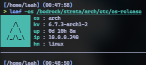
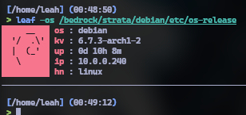
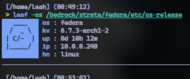

# leaf - LEAh's Fetch
A minimal, blazingly fast fetch program for Linux

Shows only the useful things, and does them pretty well

I made this out of dissatisfaction with fetch scripts, either being way too slow or showing way too much information

`leaf` is intended to be used as a greeter to your shell, where over SSH, it would show important information to your session that can be looked at from a glance

`leaf` is faster than all fetch scripts currently, at ~3ms on my hardware, compared to ~3s (neofetch, ~500ms cached), ~20ms (fastfetch), ~15ms (nofetch)
# Screenshots







# Compiling from source
Clone the repository
```
 $ git clone https://github.com/sdx6/leaf/
```
# Dependencies
Depending on your distribution of choice, install the required programs using one of these commands:
```
 # apt install make clang luajit2
```
```
 # pacman -S make clang luajit
```
```
 # dnf install make clang luajit
```
```
 # zypper install make clang
```
```nix
environment.systemPackages = [
  pkgs.gnumake42
  pkgs.rocmPackages.llvm.clang
  pkgs.luajit
];
```
Move to the repository
```
 $ cd leaf/src/
```
Build and install
```
 $ make
 # make install
```
Optionally, install locally instead of system (~/.local/bin/)
```
 $ make local
```
