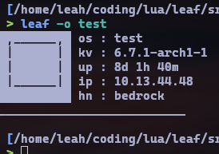

# leaf - LEAh's Fetch
///*Preston'$ note , PorT/*£*/ 2 C#
// option ? change leaf name to porte de lune : 0; */
A minimal, blazingly fast fetch program for Linux

Shows only the useful things, and does them pretty well

I made this out of dissatisfaction with fetch scripts, either being way too slow or showing way too much information

`leaf` is intended to be used as a greeter to your shell, where over SSH, it would show important information to your session that can be looked at from a glance

`leaf` is faster than all fetch scripts currently, at ~3ms on my hardware, compared to ~3s (neofetch, ~500ms cached), ~20ms (fastfetch), ~15ms (nofetch)


# Screenshots


# Contributing

Contributions to actual code is not really needed, all bases have been covered as far as necessary quick-lookup informationn

If your distribution is not supported by `leaf`, and you want to make it supported, fork the repository, and make a pull request with your distribution included

<details>
  <summary>Details</summary>
  
  ### Where to?

  In `variables` > `icons` of /src/main.lua, there is an `imgs` table that holds the icons for every distribution that `leaf` supports

  *(Code is best viewed in `vim`)*

  To add a distribution, first find the **distribution ID**, which can be found by running `cat /etc/os-release` on most Linux distributions 
  ```
   [/home/leah] (07:58:54)
   > cat /etc/os-release
  NAME="Arch Linux"
  PRETTY_NAME="Arch Linux"
  ID=arch
  BUILD_ID=rolling
  ANSI_COLOR="38;2;23;147;209"
  HOME_URL="https://archlinux.org/"
  DOCUMENTATION_URL="https://wiki.archlinux.org/"
  SUPPORT_URL="https://bbs.archlinux.org/"
  BUG_REPORT_URL="https://gitlab.archlinux.org/groups/archlinux/-/issues"
  PRIVACY_POLICY_URL="https://terms.archlinux.org/docs/privacy-policy/"
  LOGO=archlinux-logo
  ```

  The ID here for my Arch Linux stratum is "arch", under the "ID" field

  Between the `[""]` element, and the element above it, create a new dictionary element, with the distribution ID as the index

  *(This is not a Lua tutorial)*

  Create ASCII art for the distribution icon, make sure to adhere to the standard look of the previous icons


  ### Making an icon

  There are some things to consider depending on the icon you base it off of

  1. Single color, fill / background, or single line color
  
  > Set the background to an appropriate color that represents the **fill color**, and a foreground color that contrasts against the background color

  > Examples of this are the Arch Linux and Debian Linux icons

  2. Multiple colors, fill / background, or multiple line colors

  > Set the background to either black or white, and the foreground to representative of the **fill color**

  > Examples of this are the Void Linux and NixOS icons

  - Use a consistent set of characters, and test them on different fonts to see how they look

  - DO NOT fill with hashtags (or fill in general), if you need a fill color, it's probably better off as a background color

  - Set the text property to the main color of the icon, if there are more than one, choose the one that appears more often

  - Make sure to keep the icon within 1-2 columns and 1 row away from all edges (besides underscores and commas)
  ```
  ,__________,
  | ,______, |
  | |      | |  
  | |      | |
  | |______| |
  |__________|

  ```
  - The icon should rest comfortably in the space that the inner box of this diagram takes up, without peeking out any side, and it should be mostly centered


  ### I did it... Now what?

  With your changes made, recompile `leaf`
  ```
   # make test
  ```

  Run `leaf` again, with the `--override` option (shown below), followed by the ID of the icon you added

  

  If you feel it's good enough, fork the project, and make a pull request~

</details>


# Compiling from source

Clone the repository
```
 $ git clone https://github.com/sdx6/leaf/
```


# Dependencies

Depending on your distribution of choice, install the required programs using one of these commands:
```
 # apt install make clang luajit2
```
```
 # pacman -S make clang luajit
```
```
 # dnf install make clang luajit
```
```
 # zypper install make clang lua51-luajit
```
```nix
environment.systemPackages =
[
  pkgs.gnumake42
  pkgs.rocmPackages.llvm.clang
  pkgs.luajit
];
```

Move to the repository
```
 $ cd leaf/src/
```

Build and install
```
 $ make
 # make install
```

Optionally, install locally instead of system (~/.local/bin/)
```
 $ make local
```
